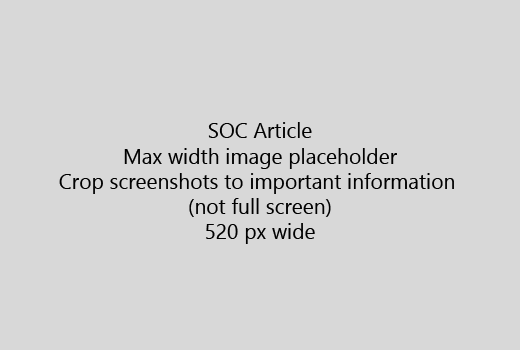

Запустите статьи с очень коротким введение (1 предложение). Поместите самостоятельно на месте средство чтения - почему они являются здесь? Что им следует сделать? 
  
1. Перейти непосредственно к быстрого список шагов для выполнения задачи.
    
    Если вам нужно поясняется концепции, или они должны выполнить необходимые предварительные действия, добавьте краткое изложение под действие, где они должны и [ссылка](https://support.office.com/article/f37e7984-cf03-4fde-92d3-82970d7e241b.aspx) на концепция или действия. 
    
2. Будьте процедуры короткий - желательно не более 5 действий, не более чем 8.
    
3. Используйте **стилю пользовательского интерфейса** для элементов пользовательского интерфейса или для текста, пользователи должны ввести. 
    
4. Использование команды выбрать, выберите, или введите в качестве действия и форматирование меню как **меню** \> **команды**.
    
5. При необходимости добавьте снимок экрана для контекста (если пользовательский Интерфейс жестко для поиска или это необходимо для выполнения задач).
    
    Максимальная ширина: 520 пикселей. Использовать стандартную тему, не показывать ваши личные сведения и обрезать для отображения только что является релевантным. 
    
    
  
Если вы хотите добавить видео или снимок экрана, используйте двух столбцов сетки и действия, описанные в слева и видео или снимок экрана в правом - видеть [действия и пример видеороликов](https://support.office.com/article/14ce8e82-efa0-47f5-bb84-94f078db3dae.aspx). 
  
Распределение не более 500 слов для статьи.
  
# Пример статьи

[Изменение личных фотографий](https://support.office.com/article/555376e0-1fca-49ba-8434-307a0525c767.aspx)
  

