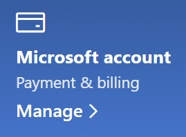

# Изменение сведений об учетной записи Майкрософт

Перейдите в раздел [https://account.microsoft.com](https://account.microsoft.com/) и выполните вход при необходимости. Откроется панель мониторинга учетной записи.  

**Изменение имени и персональных данных**

1. На панели мониторинга учетной записи рядом со своим аватаром и именем щелкните **Другие действия > Изменение профиля**.
2. На странице **Изменение профиля** используйте ссылки, предоставленные для изменения аватара, имени, даты рождения, расположения и предпочитаемого языка интерфейса. Обратите внимание, что ссылки на профили учетных записей Xbox или Skype позволяют изменить сведения, относящиеся к этим учетным записям.

**Управление адресами электронной почты и номерами телефонов**

Учетная запись Майкрософт содержит один или несколько адресов электронной почты и номеров телефонов, связанных с ней, как псевдонимы. Для управления:

1. На панели мониторинга учетной записи рядом со своим аватаром и именем щелкните **Другие действия > Изменение профиля**.
2. На странице **Изменение профиля** выберите пункт **Управление входом в Microsoft**. 
3. Отобразится список псевдонимов учетных записей, которым вы можете управлять, включая добавление и удаление адресов электронной почты и номеров телефонов. Здесь можно указать псевдонимы, которые будут использоваться для входа в учетную запись, и "основной" псевдоним, который будет отображаться на устройствах с Windows 10.

**Управление методами оплаты, а также именем и адресом для выставления счетов** 

1. На панели мониторинга учетной записи рядом со своим аватаром и именем щелкните **Другие действия > Изменение профиля**.
2. В разделе **Оплата и выставление счетов** нажмите **Управление**.

    

3. Здесь можно добавлять, изменять и удалять методы оплаты и связанные с ними адреса выставления счетов. 
