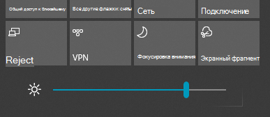

# Изменение яркости экрана в Windows 10

Если ваша Windows 10 новее, чем версия 1903, в центре действий есть **Ползунок яркость**. Чтобы открыть центр действий, нажмите кнопку **Уведомление** в правой части панели задач или нажмите **кнопку Windows + A** на клавиатуре.

Если у вас Windows 10 более ранней версии, вы можете найти ползунок яркости, выбрав **[Настройки > Система > Дисплей](ms-settings:display?activationSource=GetHelp)**.

**Примечания.**

- Вы можете не увидеть изменение яркости для встроенного ползунка дисплея на настольных ПК с внешним монитором. Чтобы изменить яркость внешнего монитора, используйте элементы управления на мониторе.
- Если у вас нет настольного ПК, а слайдер не появляется или не работает, попробуйте обновить драйвер дисплея. В поле поиска на панели задач введите **Диспетчер устройств**, а затем выберите **Диспетчер устройств** из списка результатов. В **Диспетчере устройств** выберите **Адаптеры дисплея**, затем выберите адаптер дисплея. Нажмите и удерживайте (или щелкните правой кнопкой мыши) имя адаптера дисплея и нажмите **Обновить драйвер**; затем следуйте инструкциям.
