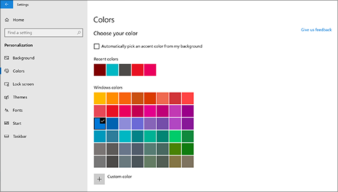
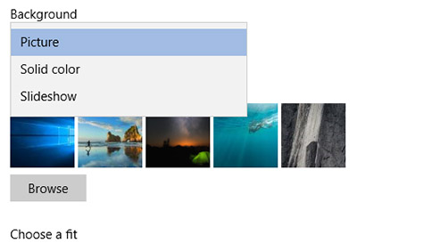

# Изменение фона и цветов рабочего столаChange your desktop background and colors

Чтобы изменить параметры цвета, перейдите к разделу " **начать** > **настройку** > **цветов\*\*\*\*персонализации** > ", а затем выберите свой цвет или позвольте Windows извлечь цвет из фона.To change your colors setting, go to **Start** > **Settings** > **Personalization** > **Colors**, and then choose your own color or let Windows pull an accent color from your background.

Чтобы**изменить фон рабочего** > стола, перейдите на страницу "**Параметры** >  **запуска** > **", а**затем выберите рисунок, сплошной цвет или создайте слайд-шоу изображений.To change your desktop background, go to **Start** > **Settings** > **Personalization** > **Background**, and then choose a picture, solid color, or create a slideshow of pictures. 

Хотите увеличить число фоновых рисунков и цветов рабочего стола?Want more desktop backgrounds and colors? Посетите [Microsoft Store](https://www.microsoft.com/store/collections/windowsthemes) , чтобы выбрать один из десятков свободных тем.Visit [Microsoft Store](https://www.microsoft.com/store/collections/windowsthemes) to choose from dozens of free themes.
