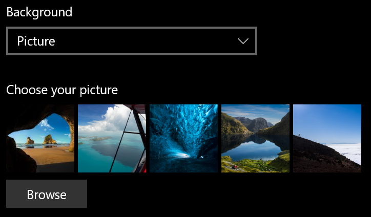
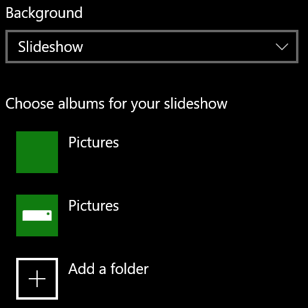

# Изменение фона экрана блокировки

- Перейдите к **экрану блокировки****личной** > **настройки** > . Или нажмите здесь или коснитесь [здесь](ms-settings:lockscreen?activationSource=GetHelp).

- Чтобы задать настраиваемый фоновый рисунок, выберите **изображение** в раскрывающемся списке **фон** и выберите или **перейдите** к изображению.

  

- Чтобы настроить показ слайдов настраиваемых изображений, выберите пункт **слайд-шоу** в раскрывающемся списке **фон** , а затем выберите альбом или добавьте папку, содержащую изображения для слайд-шоу.

  
