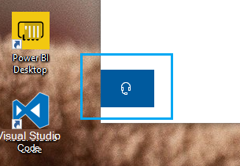

# Свяжитесь с нами, нажав кнопку наушникиContact us by clicking the headphone button

Если вы хотите обратиться в службу поддержки Майкрософт, нажмите кнопку **Contact us** в левом нижнем углу этого приложения.If you'd like to contact Microsoft Support, please click **Contact us** in the lower left corner of this app. Во всплывающем окне вы будете подразделить правильный канал поддержки после выбора категории продуктов и выпусков.Inside the fly-out window, you will be guided to the right support channel after choosing your product and issue category.

Вы можете сохранить взаимодействие с остальными частями приложения, даже после запуска сеанса связи с нами.You can keep interacting with the rest of the app even after you have initiated a Contact us session. Панель Contact us можно временно свернуть, щелкнув любое другое место в приложении.The Contact us panel can be temporarily minimized by clicking anywhere else inside the app. Чтобы вернуться к тому же сеансу, просто нажмите кнопку **связаться с нами** .To return to the same session, just click **Contact us** again.
