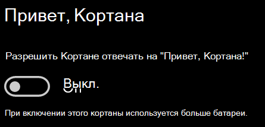

# Кортана не говорит со мной или не слышит меняCortana doesn’t talk to me or can’t hear me

Если вы пытаетесь воспользоваться функцией "Привет, Кортана!", позволяющей общаться с Кортаной без нажатия кнопки Кортаны на панели задач или кнопки микрофона на панели Кортаны, убедитесь, что функция включена.If you are trying to use the "Hey Cortana" feature, which allows you to talk to Cortana without selecting the Cortana button on the taskbar or the microphone button in the Cortana panel, confirm that the feature is enabled:

1. Нажмите **Пуск** и выберите **[Параметры > Кортана](ms-settings:cortana?activationSource=GetHelp)**.Go to **Start**, then select **[Settings > Cortana](ms-settings:cortana?activationSource=GetHelp)**.
2. В разделе **Привет, Кортана!** переведите переключатель **Разрешите Кортане отвечать на слова "Привет, Кортана!"** в положение **Вкл**.Under **Hey Cortana**, switch the **Let Cortana respond to "Hey Cortana"** toggle to **On**.

**Ваши параметры конфиденциальности не позволяют Кортане услышать вас?****Are your privacy settings preventing Cortana from hearing you?**

Ваши параметры конфиденциальности могут препятствовать реакциям Кортаны на ваш голос.Your privacy settings can prevent Cortana from responding to your voice.
- Проверьте, включено ли распознавание речи в сети:Check to make sure Online Speech recognition is turned on:
    - Нажмите **Пуск** и выберите **[Параметры > Конфиденциальность > Голосовые функции](ms-settings:privacy-speech?activationSource=GetHelp)**.Go to **Start**, then click **[Settings > Privacy > Speech](ms-settings:privacy-speech?activationSource=GetHelp)**.
    - В разделе **Распознавание голоса в сети** установите параметр **Вкл**.Under **Online speech recognition**, switch the setting to **On**.
- Проверьте наличие у Кортаны разрешения на доступ к микрофону.Check to make sure Cortana has permission to access your microphone. 
    - Нажмите "Пуск" и выберите **[Параметры > Конфиденциальность > Микрофон](ms-settings:privacy-microphone?activationSource=GetHelp)**.Go to Start, then click **[Settings > Privacy > Microphone](ms-settings:privacy-microphone?activationSource=GetHelp)**.
    - В разделе **Выбрать приложения, которые могут получать доступ к микрофону** найдите **Кортану** в списке приложений и служб и переведите ее переключатель в положение **Вкл**.Under **Choose which apps can access your microphone**, look for **Cortana** within the list of apps and services and make sure the switch is toggled to **On**.

Также убедитесь, что ваши динамики и микрофоны включены и работают, чтобы общаться с Кортаной.Moreover, please also make sure that your speakers or microphones are up and working in order to talk to Cortana.
