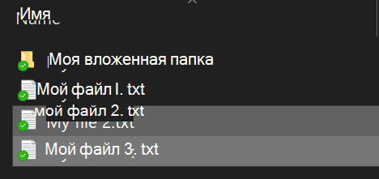
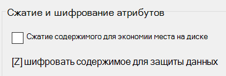

# Шифрование файлов и папок в Windows 10

С помощью BitLocker можно зашифровать весь диск целиком. Если нужно зашифровать только отдельные файлы или папки (и их содержимое), выполните следующие действия:

1. В **проводнике** выберите файлы и папки, которые нужно зашифровать. В этом примере выбрано два файла:

    

2. Щелкните выбранные файлы правой кнопкой мыши и выберите **Свойства**.

3. В окне **Свойства** щелкните **Дополнительно**.

4. В окне **Дополнительные свойства** установите флажок **Шифровать содержимое для защиты данных**:

    

5. Нажмите кнопку **ОК**.
