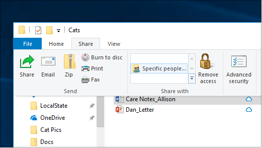
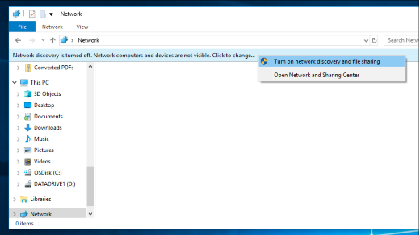

# Общий доступ к файлам в сети в Windows 10File sharing over a network in Windows 10

**Примечание.** Если вы ранее использовали HomeGroup для общего доступа к файлам, обратите внимание, что HomeGroup удалена из Windows 10 (версия 1803).**Note**: If you previously used HomeGroup for file sharing, please note that HomeGroup has been removed from Windows 10 (Version 1803). Теперь вы можете обмениваться принтерами и файлами, используя встроенные функции в Windows 10.You can now share printers and files by using built-in features in Windows 10.

**Совместное делиться файлами или папками по сети****To share files or folders over a network**

- В **Обозревателе** файлов выберите файл, > нажмите вкладку **Share** в верхней части > в разделе **Share,** нажмите кнопку **Конкретные люди**.In **File Explorer**, select a file > click the **Share** tab at the top > in the **Share with** section, click **Specific people**.

    
          
- Если вы выберите несколько файлов одновременно, вы можете поделиться ими всеми одинаково.If you select multiple files at once, you can share them all in the same way. Он также работает для папок.It works for folders, too.

**Чтобы увидеть устройства в сети, которые делятся файлами****To see devices on the network that are sharing files**

- В **обозревателе файлов** перейдите в **сеть**.In **File Explorer**, go to **Network**. Если обнаружение сети не включено, вы увидите сообщение об ошибке "Обнаружение сети отключено...".If Network discovery is not enabled, you will see an error message "Network discovery is turned off..."

- Нажмите **кнопку Открытие Сети выключен** баннер, а затем нажмите кнопку Включить обнаружение **сети и общий доступ к файлам**.Click the **Network discovery is turned off** banner, then click **Turn on network discovery and file sharing**.

    

[Дополнительные материалы о совместном использовании файлов в сетиRead more about file sharing over a network](https://support.microsoft.com/help/4092694/windows-10-file-sharing-over-a-network)

[Совместное использование файлов с помощью приложений, OneDrive, электронных писем и другихShare files using apps, OneDrive, emails, and more](https://support.microsoft.com/help/4027674/windows-10-share-files-in-file-explorer)
