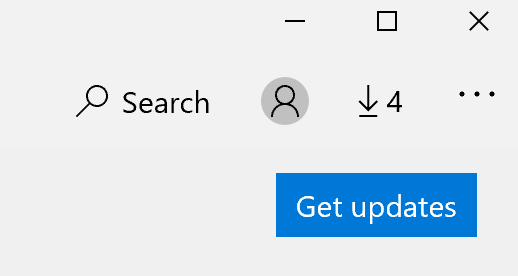

# Исправление языка отображения приложенийFix the display language of apps

После изменения языка интерфейса в Windows 10 некоторые приложения по-прежнему могут использовать предыдущий язык при открытии.After you change the display language in Windows 10, some apps may still use the previous language when you open them. Это происходит из-за того, что новые версии приложений для этого языка должны быть загружены из хранилища.This happens because new versions of the apps for that language must be downloaded from the Store. Чтобы устранить эту проблему, можно либо дождаться автоматического обновления, либо установить обновленную версию приложений вручную.To fix this problem, you can either wait for the automatic update, or you can manually install the updated version of the apps.

Чтобы вручную установить обновление, откройте **Microsoft Store** и щелкните **загрузки и обновления** в правом верхнем углу.To manually install the update, open **Microsoft Store** and click **Downloads and updates** in the top right corner. Затем нажмите кнопку **Get Updates (получить обновления**).Then click **Get updates**. Если по завершении обновления язык не изменяется, попробуйте перезагрузить компьютер.If the language is not changed after the update is complete, try restarting your PC.

Дополнительные сведения о параметрах языка ввода и отображения можно узнать [в статье Управление параметрами языка ввода и вывода в Windows 10](https://support.microsoft.com/help/4027670/windows-10-add-and-switch-input-and-display-language-preferences).To read more about input and display language settings, see [Manage your input and display language settings in Windows 10](https://support.microsoft.com/help/4027670/windows-10-add-and-switch-input-and-display-language-preferences).
