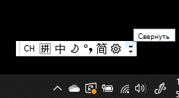
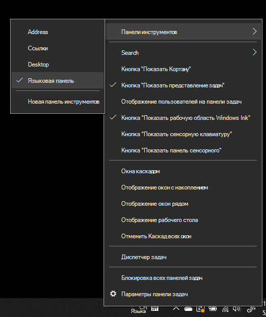
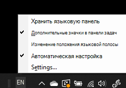

# Скрыть, отобразить или сбросить языковую панельHide, display, or reset the language bar

**Чтобы свернуть языковую панель:****To minimize the language bar:**

Вы можете нажать кнопку сворачивания в правом верхнем углу языковой панели.You can click the minimize button on the top right corner of the language bar. Или вы можете просто перетащить языковую панель на панель задач, которая автоматически свернет ее.Or, you can just drag the language bar to the task bar, which will automatically minimize it.

**Чтобы открыть языковую панель:****To pop out the language bar:**

Если вы не хотите закреплять языковую панель на панели задач, щелкните правой кнопкой мыши любое пустое место на панели задач и снимите флажок с опции **Языковая панель** в меню Панели инструментов.If you don't want to dock the language bar in the taskbar, right-click any empty space in the taskbar, and uncheck the **Language bar** option in the Toolbars menu. Это заставит языковую панель появиться за пределами панели задач, как и на предыдущем скриншоте.This will make the language bar appear outside the taskbar, just like the previous screenshot.

**Чтобы восстановить языковую панель по умолчанию:****To restore the language bar to default:**

Щелкните правой кнопкой мыши кнопку языка на панели инструментов и выберите пункт **Восстановить языковую панель** в меню.Right-click the language button in the toolbar, and click **Restore the language bar** option in the menu. При этом будет восстановлено значение по умолчанию.This will restore it to default.

