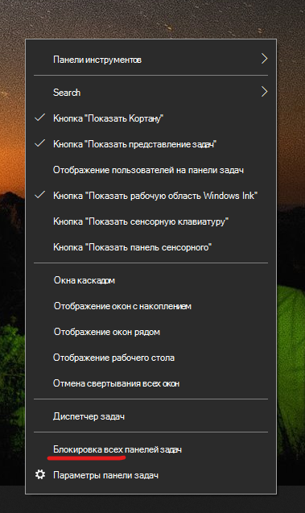

# Переместите панель задач в любую сторону или верхнюю часть рабочего стола.

Сначала убедитесь, что панель задач разблокирована. Чтобы узнать, разблокирована ли ваша учетная запись, щелкните правой кнопкой мыши любое пустое место на панели задач и посмотрите, есть ли рядом с ним флажок **Блокировка панели задач**. Если есть галочка, панель задач заблокирована и не может быть перемещена. Нажав **Блокировать панель задач** один раз, вы разблокируете ее и снимите галочку.

Если у вас есть несколько мониторов, которые отображают панель задач, вы увидите **Блокировать все панели задач**.

Когда панель задач разблокирована, вы можете нажать и удерживать любое пустое место на панели задач и перетащить его в нужное место на экране. Вы также можете сделать это, щелкнув правой кнопкой мыши на любом пустом месте на панели задач и перейдя в **[Настройки панели задач](ms-settings:taskbar?activationSource=GetHelp) > Расположение панели задач на экране**.
