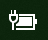

# В Windows 10 отсутствует значок питания или батареи

Если на устройстве с Windows 10 есть батарея (например, ноутбук, планшет или компьютер, подключенный по USB к ИБП), на панели задач рядом с часами обычно отображается значок питания или батареи. Например:

Если вы не видите этот значок, он может быть скрыт:

1. Выберите **[Параметры > Персонализация > Панель задач](ms-settings:taskbar?activationSource=GetHelp)**.

2. В области уведомлений щелкните **Выберите значки, отображаемые в панели задач**.

3. Затем найдите элемент **Питание** в списке и переведите его переключатель в положение **Вкл**.

    

**Устранение неполадок**

Если при выполнении вышеуказанных инструкций переключатель **Питание** затенен или не виден, в поле поиска на панели задач введите **диспетчер устройств** и выберите **Диспетчер устройств** в списке результатов. В разделе **Батареи** щелкните правой кнопкой мыши батарею своего устройства, выберите **Отключить** и щелкните **Да**. Подождите несколько секунд, щелкните правой кнопкой мыши батарею и выберите **Включить**. Перезагрузите устройство.

Если вы выполнили вышеуказанные инструкции, но значок батареи не отображается на панели задач, в поле поиска на панели задач введите **диспетчер задач** и щелкните **Диспетчер задач** в списке результатов. На вкладке **Процессы** в столбце **Имя** щелкните правой кнопкой мыши **Проводник** и нажмите **Перезапустить**.
