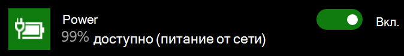

# В Windows 10 отсутствует значок питания или батареиPower or battery icon missing in Windows 10

Если на устройстве с Windows 10 есть батарея (например, ноутбук, планшет или компьютер, подключенный по USB к ИБП), на панели задач рядом с часами обычно отображается значок питания или батареи. Например:If your Windows 10 device has a battery (e.g., laptop or tablet, or a PC connected via USB to a UPS), normally a power/battery icon is shown in the taskbar near the clock, for example:

Если вы не видите этот значок, он может быть скрыт:If you don't see this icon, it may be hidden:

1. Выберите **[Параметры > Персонализация > Панель задач](ms-settings:taskbar?activationSource=GetHelp)**.Go to **[Settings > Personalization > Taskbar](ms-settings:taskbar?activationSource=GetHelp)**.

2. В области уведомлений щелкните **Выберите значки, отображаемые в панели задач**.In the Notification area, click **Select which icons appear on the taskbar**.

3. Затем найдите элемент **Питание** в списке и переведите его переключатель в положение **Вкл**.Then find the **Power** item in the list and toggle its setting to **On**.

    

**Устранение неполадок****Troubleshooting**

Если при выполнении вышеуказанных инструкций переключатель **Питание** затенен или не виден, в поле поиска на панели задач введите **диспетчер устройств** и выберите **Диспетчер устройств** в списке результатов.If you followed the above instructions and the **Power** toggle is greyed out or not visible, in the search box on the taskbar, type **device manager**, and then select **Device Manager** in the list of results. В разделе **Батареи** щелкните правой кнопкой мыши батарею своего устройства, выберите **Отключить** и щелкните **Да**.Under **Batteries**, right-click the battery for your device, click **Disable**, and click **Yes**. Подождите несколько секунд, щелкните правой кнопкой мыши батарею и выберите **Включить**.Wait a few seconds, and then right-click the battery and click **Enable**. Перезагрузите устройство.Then restart your device.

Если вы выполнили вышеуказанные инструкции, но значок батареи не отображается на панели задач, в поле поиска на панели задач введите **диспетчер задач** и щелкните **Диспетчер задач** в списке результатов.If you followed the above instructions, but the battery icon does not appear on the taskbar, in the search box on the taskbar, type **task manager**, and then click **Task Manager** in the list of results. На вкладке **Процессы** в столбце **Имя** щелкните правой кнопкой мыши **Проводник** и нажмите **Перезапустить**.On the **Processes** tab, under **Name**, right-click **Explorer**, and then click **Restart**.
