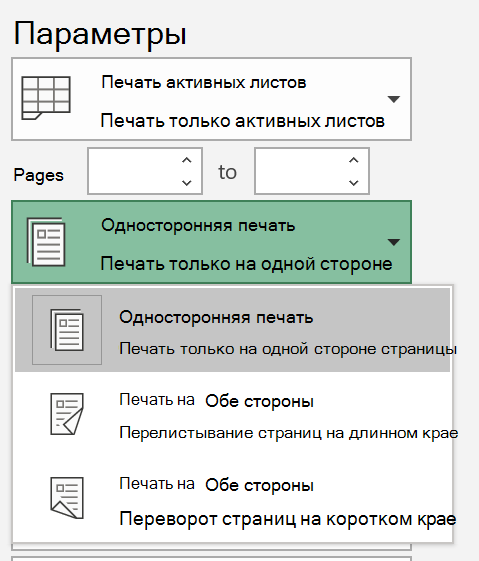
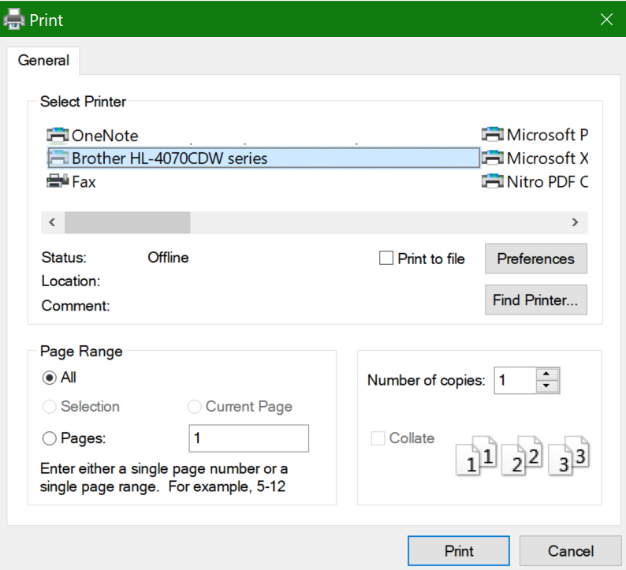

# Печать на обеих сторонах листа (двусторонняя печать)

**Мой принтер поддерживает двустороннюю печать?**

В обзоре функций или руководстве вашего принтера должно быть указано, может ли он печатать на обеих сторонах листа (другое название — двусторонняя печать). Если у вас есть Microsoft Office, другой способ узнать это — открыть приложение Office, например Word или Excel, выбрать **Файл > Печать**, выбрать нужный принтер и найти функцию в разделе "Параметры". Например: 

**Двусторонняя печать в Microsoft Office**

Если принтер может печатать на обеих сторонах, при выборе раздела **Файл > Печать** в приложении Office вы увидите параметр "Двусторонняя печать", как показано в примере выше.  Выберите нужный тип двусторонней печати (переплет сбоку или переплет сверху) и щелкните **Печать**, чтобы начать распечатку.

**Двусторонняя печать из любого приложения**

Во многих приложениях при печати отображается общее диалоговое окно печати, которое выглядит примерно так: 

Выберите нужный принтер и щелкните **Настройки**, чтобы открыть окно настроек принтера. Если принтер поддерживает двустороннюю печать, ее можно включить в этом окне для текущего задания печати.
