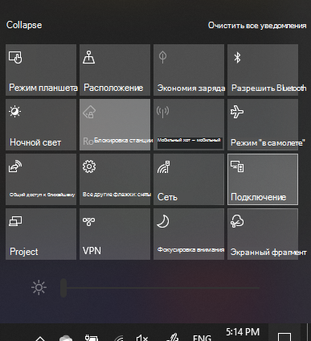

# Проецирование на компьютер

На своем устройстве назначения (на которое выполняется проецирование) выполните поиск по запросу "Параметры проецирования", чтобы открыть страницу параметров в разделе **Проецирование на этот компьютер**. Убедитесь, что:
- Для раскрывающегося меню "Некоторые устройства Windows и Android могут проецировать на этот компьютер, если вы согласны" установлено значение **Всегда отключено**.
- Для раскрывающегося меню "Запрос проецирования на этот компьютер" установлено значение **Каждый раз, когда требуется подключение**.
- Для раскрывающегося меню "Запрашивать ПИН-код для связывания" установлено значение **Никогда**.

На своем устройстве назначения запустите приложение **Подключение**, перейдя на **начальную страницу** и выполнив поиск по запросу "Подключение".

Затем на исходном устройстве, с которого вы хотите проецировать:

1. Нажмите клавиши **Windows+A**, чтобы открыть центр уведомлений.
2. Нажмите кнопку **Подключить**.
3. Выберите устройство, на которое вы хотите проецировать экран.

После выполнения описанных выше действий на устройстве назначения должен отобразиться экран исходного устройства, как если бы это был дополнительный монитор.
