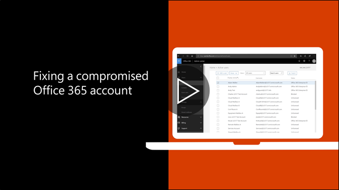

# Рекомендуемых действий, выполняемых, если раскрыты учетной записи

  
1. Немедленный [Сброс пароля пользователя](https://support.office.com/article/7a5d073b-7fae-4aa5-8f96-9ecd041aba9c) . Не связь новый пароль по электронной почте для конечного пользователя. 
    
2. Удалите все подозрительные [переадресации адреса](https://support.office.com/article/ab5eb117-0f22-4fa7-a662-3a6bdb0add74) на уровне почтового ящика. 
    
3. Удалите все подозрительные [правила папки «Входящие»](https://support.office.com/article/1433E3A0-7FB0-4999-B536-50E05CB67FED) в почтовом ящике. 
    
4. Если пользователь блокируется отправляет сообщения электронной почты, [перейдите на ограниченный доступ к разблокировать учетную запись](https://protection.office.com/?hash=/restrictedusers). После этого пользователя должна появиться возможность возобновления может отправлять сообщения в течение 1 часа.
    
5. Удалите учетную запись пользователя из [группы административных ролей](https://support.office.com/article/eac4d046-1afd-4f1a-85fc-8219c79e1504) , пока вы уверены в том, что учетная запись больше не раскрыты. 
    
Чтобы снизить риск нарушение данных или атаке учетной записи в будущем, рекомендуется наших [наиболее статьи по безопасности Office 365](https://support.office.com/article/9295e396-e53d-49b9-ae9b-0b5828cdedc3).
  

