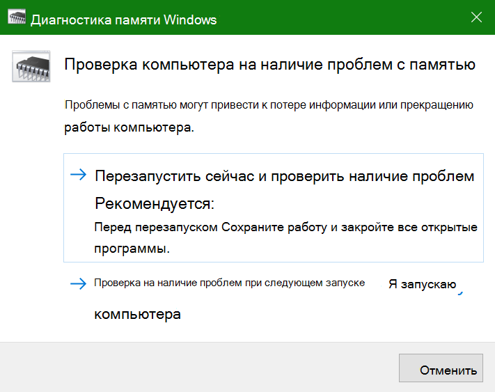

# Запуск диагностики памяти Windows в Windows 10

Если Windows и приложения на компьютере дают сбой, зависают или работают неустойчиво, возможно, у вас возникла проблема с памятью компьютера (ОЗУ). Вы можете запустить диагностику памяти Windows, чтобы проверить, есть ли у компьютера проблемы с ОЗУ.

В поле поиска на панели задач введите **Диагностика памяти**, а затем выберите **Диагностика памяти Windows**. 

Чтобы запустить диагностику, компьютер необходимо перезапустить. Вы можете перезагрузить компьютер немедленно (сначала сохраните свою работу и закройте открытые документы и сообщения электронной почты) или запланировать автоматический запуск диагностики при следующей перезагрузке компьютера.

Когда компьютер перезагрузится, **Средство диагностики памяти Windows** запустится автоматически. В процессе диагностики будет отображаться ее состояние и ход выполнения. Отменить диагностику можно, нажав на клавиатуре клавишу **ESC**.

По завершении диагностики Windows запускается в обычном режиме.
Сразу после перезапуска, когда отобразится рабочий стол, рядом со значком **Центр уведомлений** на панели задач появится уведомление о том, были ли найдены ошибки в памяти. Например:

Это значок Центра уведомлений:  

Пример уведомления: 

Если вы пропустили уведомление, можно выбрать значок **Центр уведомлений** на панели задач, чтобы вывести на экран **Центр уведомлений** и просмотреть прокручиваемый список уведомлений.

Чтобы ознакомиться с подробными сведениями, в поле поиска на панели задач введите **событие** и выберите **Просмотр событий**. В левой панели **Просмотра событий ** перейдите в раздел **Журналы Windows > Система**. В правой панели прокрутите список вниз, пока в столбце **Источник** не появятся события со значением **MemoryDiagnostics-Results**. Выделите каждое такое событие и ознакомьтесь со сведениями в поле вкладки **Общие**, расположенной под списком.
