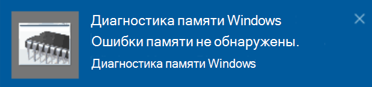

# Запуск диагностики памяти Windows в Windows 10Run Windows Memory Diagnostics in Windows 10

Если Windows и приложения на компьютере дают сбой, зависают или работают неустойчиво, возможно, у вас возникла проблема с памятью компьютера (ОЗУ).If Windows and apps on your PC are crashing, freezing, or acting in an unstable manner, you may have a problem with the PC’s memory (RAM). Вы можете запустить диагностику памяти Windows, чтобы проверить, есть ли у компьютера проблемы с ОЗУ.You can run the Windows Memory Diagnostic to check for problems with the PC’s RAM.

В поле поиска на панели задач введите **Диагностика памяти**, а затем выберите **Диагностика памяти Windows**.In the search box on your taskbar, type **memory diagnostic**, and then select **Windows Memory Diagnostic**. 

Чтобы запустить диагностику, компьютер необходимо перезапустить.To run the diagnostic, the PC needs to restart. Вы можете перезагрузить компьютер немедленно (сначала сохраните свою работу и закройте открытые документы и сообщения электронной почты) или запланировать автоматический запуск диагностики при следующей перезагрузке компьютера.You have the option to restart immediately (please save your work and close open documents and e-mails first), or schedule the diagnostic to run automatically the next time the PC restarts:

Когда компьютер перезагрузится, **Средство диагностики памяти Windows** запустится автоматически.When the PC restarts, the **Windows Memory Diagnostics Tool** will run automatically. В процессе диагностики будет отображаться ее состояние и ход выполнения. Отменить диагностику можно, нажав на клавиатуре клавишу **ESC**.Status and progress will be displayed as the diagnostics run, and you have the option of cancelling the diagnostics by hitting the **ESC** key on your keyboard.

По завершении диагностики Windows запускается в обычном режиме.When the diagnostics are complete, Windows will start normally.
Сразу после перезапуска, когда отобразится рабочий стол, рядом со значком **Центр уведомлений** на панели задач появится уведомление о том, были ли найдены ошибки в памяти.Immediately after restart, when the Desktop appears, a notification will appear (next to the **Action Center** icon on the taskbar), to indicate whether any memory errors were found. Например:For example:

Это значок Центра уведомлений:Here's the Action Center icon:  

Пример уведомления:And a sample notification: 

Если вы пропустили уведомление, можно выбрать значок **Центр уведомлений** на панели задач, чтобы вывести на экран **Центр уведомлений** и просмотреть прокручиваемый список уведомлений.If you missed the notification, you can select the **Action Center** icon  on the taskbar to display the **Action Center** and see a scrollable list of notifications.

Чтобы ознакомиться с подробными сведениями, в поле поиска на панели задач введите **событие** и выберите **Просмотр событий**.To review detailed information, type **event** into the search box on your taskbar, and then select **Event Viewer**. В левой панели \*\*Просмотра событий \*\* перейдите в раздел **Журналы Windows > Система**.In the **Event Viewer**’s left-hand pane, navigate to **Windows Logs > System**. В правой панели прокрутите список вниз, пока в столбце **Источник** не появятся события со значением **MemoryDiagnostics-Results**.In the right-hand pane, scan down the list while looking at the **Source** column, until you see events with Source value **MemoryDiagnostics-Results**. Выделите каждое такое событие и ознакомьтесь со сведениями в поле вкладки **Общие**, расположенной под списком.Highlight each such event and see the result information in the box under the **General** tab below the list.
