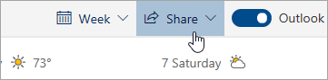

# Предоставление общего доступа в Outlook в ИнтернетеSharing with Outlook on the web

Находясь в календаре, в верхней части страницы нажмите кнопку  **Общий доступ**, а затем выберите календарь, которым нужно поделиться.From your Calendar, on the toolbar at the top of the page, select **Share**, and choose the calendar you want to share.

    

**Примечание**. Вы не можете делиться календарями, принадлежащими другим пользователям.**Note**: You can't share calendars owned by other people.

- Введите имя или адрес электронной почты пользователя, которому необходимо предоставить общий доступ к календарю.Enter the name or email address of the person you want to share your calendar with.
- Выберите уровень доступа пользователя к календарю.Choose how you want the person to use your calendar:
    - Если выбрать вариант **Может просматривать сведения о моей занятости** , пользователь сможет просматривать сведения о вашей занятости, но ему будут недоступны подробности, такие как место проведения события.**Can view when I'm busy** lets them see when you're busy but doesn't include details like the event location.
    - Если выбрать вариант **Может просматривать название и место проведения** , пользователь сможет просматривать сведения о вашей занятости, а также названия и места проведения событий.**Can view titles and locations** lets them see when you're busy, as well as the title and location of events.
    - Если выбрать вариант **Может просматривать все сведения** , пользователь сможет просматривать все сведения о ваших событиях.**Can view all details** lets them see all the details of your events.
    - Если выбрать вариант **Может вносить изменения** , пользователь сможет редактировать ваш календарь.**Can edit** lets them edit your calendar.
    - Если выбрать вариант **Представителю** , пользователь сможет редактировать календарь и предоставлять к нему доступ другим пользователям.**Delegate** lets them edit your calendar and share it with others.
- Нажмите  **Общий доступ**.Select **Share**.
