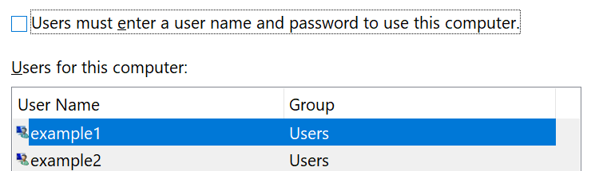

# Вход в Windows 10 без использования пароля

Чтобы не вводить пароль при запуске Windows, мы рекомендуем использовать один из параметров безопасного входа в Windows Hello, таких как ПИН-код, распознавание лица или отпечаток, если он доступен. Если вы действительно хотите отключить безопасный вход в систему, ознакомьтесь с разделом "Автоматический вход в Windows 10".

**Защита альтернативными альтернативами Windows Hello паролем учетной записи**

Перейдите в раздел **параметры > учетных записей > параметры входа** (или щелкните [здесь](ms-settings:signinoptions?activationSource=GetHelp)). Будут отображены доступные параметры входа. Например:

Нажмите один из параметров, чтобы настроить его. В следующий раз при запуске или разблокировании Windows вы сможете использовать параметр создать вместо пароля. 

**Автоматический вход в Windows 10**

**Note**: автоматический вход в систему удобен, но представляет угрозу безопасности, особенно если ваш компьютер доступен нескольким людям. 

1. Нажмите кнопку " **Пуск** " на панели задач.

2. Введите **нетплвиз** и нажмите клавишу ВВОД, чтобы открыть окно учетные записи пользователей.

3. В разделе **учетные записи пользователей**щелкните учетную запись, на которую необходимо автоматически войти при запуске Windows.

4. Снимите флажок "пользователи должны ввести имя пользователя и пароль для использования этого компьютера".

    

5. Нажмите кнопку **ОК**. Вам будет предложено ввести и подтвердить пароль для выбранной учетной записи. Для завершения нажмите кнопку **ОК**. В следующий раз при запуске Windows 10 автоматически будет входить в выбранную учетную запись.
