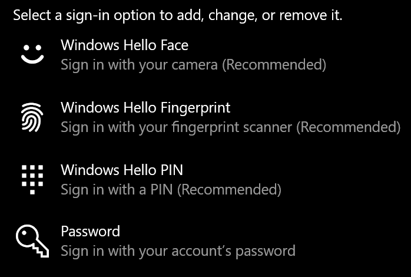
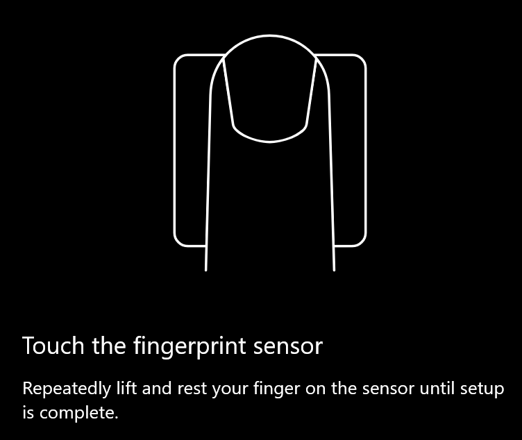
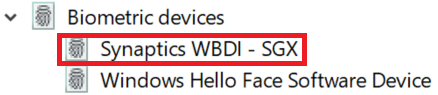

# Использование параметра разблокировки отпечатков пальцев в Windows 10

**Включить отпечаток Windows Hello**

Чтобы разблокировать Windows 10 с помощью отпечатка пальца, необходимо настроить windows Hello Fingerprint, добавив (позволяя Windows научиться распознавать) по крайней мере один палец. 

1. Перейдите **к параметрам > учетных записей > параметров** регистрации (или нажмите [здесь).](ms-settings:signinoptions?activationSource=GetHelp) Будут перечислены доступные параметры входов. Например,

    

2. Щелкните или нажмите **кнопку Windows Hello Fingerprint**, а затем нажмите **кнопку Настройка**. В окне установки Windows Hello нажмите кнопку **Начало** работы. Датчик отпечатков пальцев активируется, и вам будет предложено разместить палец на датчике:

   

3. Следуйте инструкциям, которые будут просить вас повторно сканировать палец. После этого у вас будет возможность добавить другие пальцы, которые можно использовать для регистрации. При следующем входе в Windows 10 у вас будет возможность использовать для этого свой отпечаток пальца.

**Windows Hello Fingerprint недоступна в качестве параметра входной**

Если windows Hello Fingerprint не отображается в качестве параметра в параметрах **Вход,** это означает, что Windows не знает о считывателье или сканере отпечатков пальцев, подключенных к компьютеру, или о том, что системная политика не позволяет использовать его (если, например, компьютер управляется на рабочем месте). Устранение неполадок: 

1. Выберите **кнопку Начните** в панели задач и выберите **диспетчер устройств.**

2. Щелкните или нажмите кнопку, чтобы **открыть диспетчер устройств.**

3. В диспетчере устройств разойдитесь по биометрическим устройствам, щелкнув его шеврон.

   

4. Сканер отпечатков пальцев должен быть указан как биометрическое устройство, например сканер WBDI Synaptics:

   

5. Если сканер отпечатков пальцев не показан и сканер интегрирован в компьютер, перейдите на веб-сайт производителя ПК. В разделе техническая поддержка для модели ПК ищите драйвер Windows 10 для сканера, который можно установить.

6. Если сканер отделен от компьютера (присоединен через USB), перейдите на веб-сайт производителя сканера, чтобы найти и установить программное обеспечение драйвера устройства Windows 10 для модели сканера.
