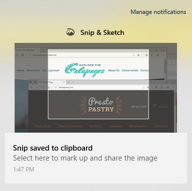

# Использование & эскизов для захвата, маркировки и совместного использования изображений

Теперь набросок экрана называется **фрагментом & эскиза**. **Чтобы быстро создать фрагмент,** сделайте следующее:

1. Нажмите клавишу с **логотипом Windows + Shift + S**. Экран будет отображаться темнее, а курсор будет отображаться в виде перекрестия. 

2. Выберите точку на краю области, которую необходимо скопировать, и щелкните курсор левой кнопкой мыши. 

3. Переместите курсор, чтобы выделить область, которую необходимо записать. Область, которую вы захватите, будет отображаться на экране.

   

Изображение, которое вы обрезанными, будет сохранено в буфере обмена, а затем будет готово к вставке в электронное письмо или документ. 

**Если вы хотите изменить или просмотреть изображение**: 

- Щелкните значок уведомления в крайней правой части панели задач; затем щелкните только что записанный снимок. Ваш фрагмент открывается в приложении & наброска фрагмента.

   
