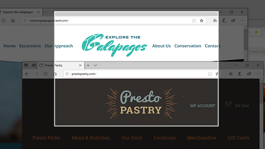

# Использование Snip & Sketch для захвата, разметки и обмена изображениямиUse Snip & Sketch to capture, mark up, and share images

Эскиз экрана теперь называется **Snip & Sketch**.Screen sketch is now called **Snip & Sketch**. **Чтобы быстро взять фрагмент:****To quickly take a snip**:

1. Нажмите **клавишу логотипа Windows + Shift + S**. Вы увидите, что экран темнеет, а курсор отображается как крест.Press the **Windows logo key + Shift + S**. You'll see your screen darken and your cursor displayed as a cross. 

2. Выберите точку на краю области, которая необходимо скопировать, и щелкните курсор влево.Choose a point at the edge of the area you want to copy and left-click the cursor. 

3. Переместите курсор, чтобы выделить область, которая вы хотите захватить.Move your cursor to highlight the area you want to capture. Область захвата появится на экране.The area you capture will appear on your screen.

   

Изображение, которое вы отрезали, сохранено в буфере обмена, готовое для вклейки в электронную почту или документ.The image you snipped is saved to your clipboard, ready for pasting into an email or document. 

**Если вы хотите изменить или просмотреть изображение:****If you want to edit or view the image**: 

- Щелкните значок уведомлений в правой правой части панели задач; затем щелкните только что захваченную фотографию.Click the notifications icon at the far right side of the taskbar; then click the picture you have just captured. Ваш фрагмент открывается в приложении Snip & Sketch.Your snip opens in the Snip & Sketch app.

   
