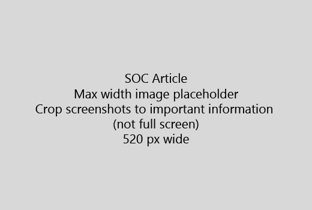

Запустите статьи с очень коротким введение (1 предложение). Поместите самостоятельно на месте средство чтения - почему они являются здесь? Что им следует сделать?Start your article with a very short introduction (1 sentence). Put yourself in the reader's place - why are they here? What should they do? 
  
1. Перейти непосредственно к быстрого список шагов для выполнения задачи.Get straight to a quick list of steps to accomplish the task.
    
    Если вам нужно поясняется концепции, или они должны выполнить необходимые предварительные действия, добавьте краткое изложение под действие, где они должны и [ссылка](https://support.office.com/article/f37e7984-cf03-4fde-92d3-82970d7e241b.aspx) на концепция или действия.If you need to explain a concept, or they have to do pre-requisite steps, add a quick summary below the step where they need it, and [link](https://support.office.com/article/f37e7984-cf03-4fde-92d3-82970d7e241b.aspx) to the concept or steps. 
    
2. Будьте процедуры короткий - желательно не более 5 действий, не более чем 8.Keep procedures short - preferably 5 or fewer steps, no more than 8.
    
3. Используйте **стилю пользовательского интерфейса** для элементов пользовательского интерфейса или для текста, пользователи должны ввести.Use **Ui style** for user interface elements or for text people need to enter. 
    
4. Использование команды выбрать, выберите, или введите в качестве действия и форматирование меню как **меню** \> **команды**.Use the verbs choose, select, or enter as actions, and format menus as **Menu** \> **Command**.
    
5. При необходимости добавьте снимок экрана для контекста (если пользовательский Интерфейс жестко для поиска или это необходимо для выполнения задач).Optionally, add a screenshot for context (if UI is hard to locate, or it's needed to complete the task).
    
    Максимальная ширина: 520 пикселей. Использовать стандартную тему, не показывать ваши личные сведения и обрезать для отображения только что является релевантным.Maximum width: 520 pixels. Use a standard theme, do not show any personal information, and crop to show only what's relevant. 
    
    
  
Если вы хотите добавить видео или снимок экрана, используйте двух столбцов сетки и действия, описанные в слева и видео или снимок экрана в правом - видеть [действия и пример видеороликов](https://support.office.com/article/14ce8e82-efa0-47f5-bb84-94f078db3dae.aspx).If you want to add a video or screenshot, use a two-column grid and have the steps in the left and the video or screenshot in the right - see [Steps and video grid example](https://support.office.com/article/14ce8e82-efa0-47f5-bb84-94f078db3dae.aspx). 
  
Распределение не более 500 слов для статьи.Target no more than 500 words for an article.
  
# Пример статьиExample article

[Изменение личных фотографийChange my photo](https://support.office.com/article/555376e0-1fca-49ba-8434-307a0525c767.aspx)
  

