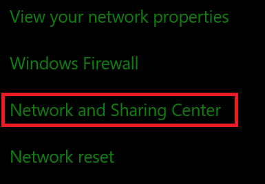
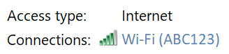
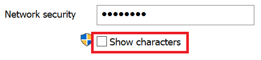

# Просмотр Wi-Fi сетевого пароля в Windows 10

1. Убедитесь, Windows 10 компьютер подключен к Wi-Fi сети.

2. Перейдите **в Параметры > Network & internet > status**, или  нажмите кнопку здесь, чтобы позволить нам принять вас там сейчас.)

3. Выберите пункт **Центр управления сетями и общим доступом**.

    

4. В **Центре сетевых и совместных** подключений ( рядом с **подключениями)** вы увидите имя беспроводной сети. Например, если сеть называется "ABC123", можно увидеть:

    

    Щелкните имя беспроводной сети, чтобы открыть окно Wi-Fi состояния. 

5. В окне Wi-Fi состояния щелкните **Беспроводные свойства,** щелкните вкладку **Безопасность** и проверьте **символы Show**.

    

